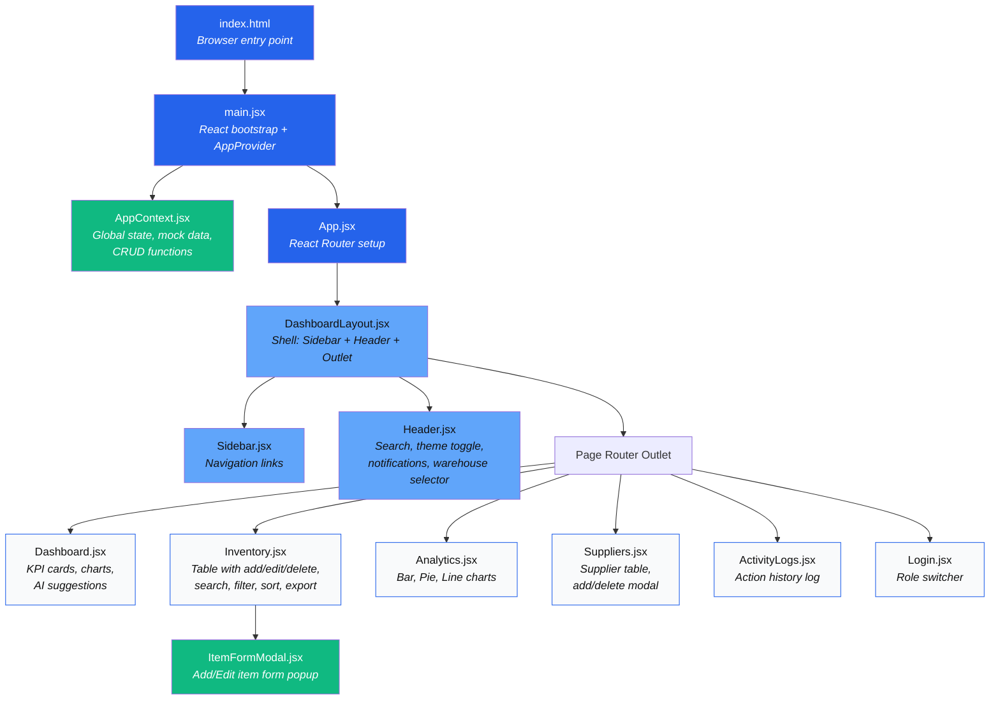
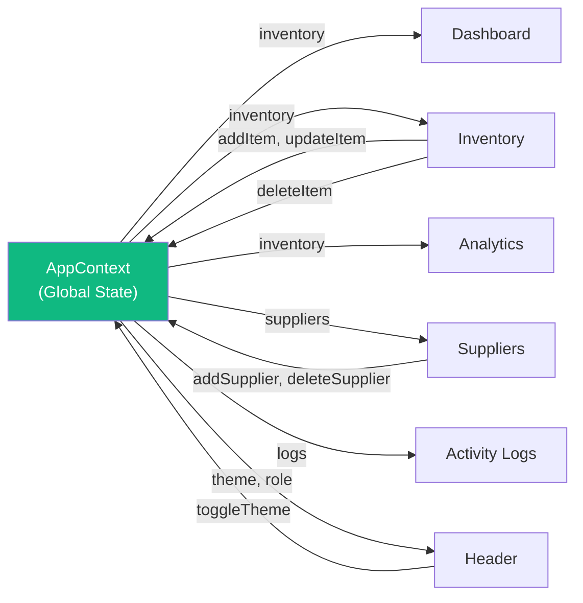

# Warehouse Management System — Project Architecture

## High-Level Flow

---

## File-by-File Breakdown

### 🔵 Core Bootstrap

| File | Purpose |
|------|---------|
| `index.html` | The single HTML page that the browser loads. Contains the `
` mount point. |
| `main.jsx` | Boots React, wraps the entire app in `<AppProvider>` (global state), renders `<App />`. |
| `App.jsx` | Defines all routes via `react-router-dom`. Maps URL paths to page components inside the `DashboardLayout`. |

---

### 🟢 State Management

| File | Purpose |
|------|---------|
| `contexts/AppContext.jsx` | **The brain of the app.** Holds all mock inventory, supplier, and log data. Exposes CRUD functions (`addItem`, `updateItem`, `deleteItem`, `addSupplier`, `deleteSupplier`, `addLog`), theme toggling, role switching, and warehouse filtering to every component via React Context. |

---

### 🔷 Layout Shell

| File | Purpose |
|------|---------|
| `layouts/DashboardLayout.jsx` | Assembles the page structure: Sidebar on the left, Header on top, page content via `<Outlet />` in the center. |
| `layouts/Sidebar.jsx` + `.css` | Renders the left navigation panel with links to Dashboard, Inventory, Analytics, Suppliers, Activity Logs, and Login. Uses `<NavLink>` for active-state highlighting. |
| `layouts/Header.jsx` + `.css` | Top bar with: global search input, warehouse selector dropdown, theme toggle (sun/moon), notification bell (dynamically shows low-stock alerts), and user profile display. |

---

### 📄 Pages

| File | Purpose |
|------|---------|
| `pages/Dashboard.jsx` + `.css` | Main overview. Shows KPI stat cards (total items, low-stock alerts, total value, categories), a bar chart of stock by category, a pie chart of warehouse distribution, and AI-style smart reorder suggestions. |
| `pages/Inventory.jsx` + `.css` | Full inventory management table. Features: search, category filter, sorting by columns, add/edit/delete items, CSV export, pagination, and row highlighting for low-stock items. |
| `pages/Analytics.jsx` + `.css` | Detailed analytics with three chart types: bar chart (stock levels), pie chart (category distribution), and line chart (stock movement trends). |
| `pages/Suppliers.jsx` | Supplier directory table. Add new suppliers via a styled in-app modal, delete suppliers, and view status badges (Active/Inactive). |
| `pages/ActivityLogs.jsx` | Chronological log of all actions (ADD, DELETE, RESTOCK, DISPATCH, UPDATE) with timestamps, user attribution, and quantity changes. |
| `pages/Login.jsx` + `.css` | Role switcher interface. Allows toggling between Admin and Staff roles to demonstrate role-based access differences. |

---

### 🧩 Reusable Components

| File | Purpose |
|------|---------|
| `components/ItemFormModal.jsx` + `.css` | A styled popup modal form used by the Inventory page to add new items or edit existing ones. Fields: name, category, warehouse, quantity, price, min stock threshold, supplier. |

---

### 🎨 Styling

| File | Purpose |
|------|---------|
| `index.css` | **Global design system.** CSS custom properties for the entire color palette, typography, spacing, shadows, animations (`slideUpFade`, `pulseDanger`), and reusable utility classes (`.card`, `.btn-primary`, `.badge`, `.input-field`, etc.). Controls both light and dark mode via `[data-theme]`. |
| `App.css` | Additional app-level layout styles. |

---

### 📁 Other

| File | Purpose |
|------|---------|
| `package.json` | Project dependencies: `react`, `react-router-dom`, `lucide-react` (icons), `recharts` (charts), `date-fns` (date formatting). |
| `vite.config.js` | Vite bundler configuration with React plugin. |
| `.gitignore` | Excludes `node_modules/` and build artifacts from Git. |

---

## Data Flow Summary

> Every page **reads** from AppContext. Pages that modify data (Inventory, Suppliers) **write back** to AppContext, which triggers re-renders across the entire app automatically.
