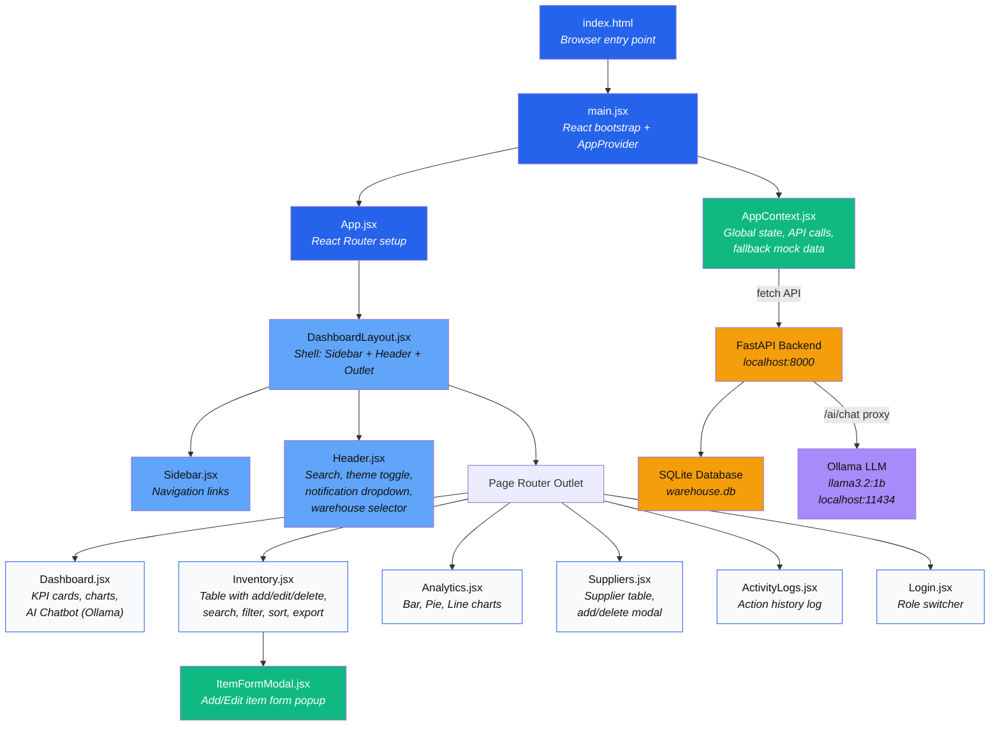
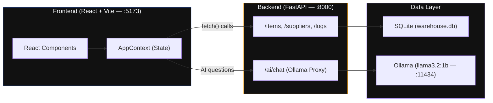
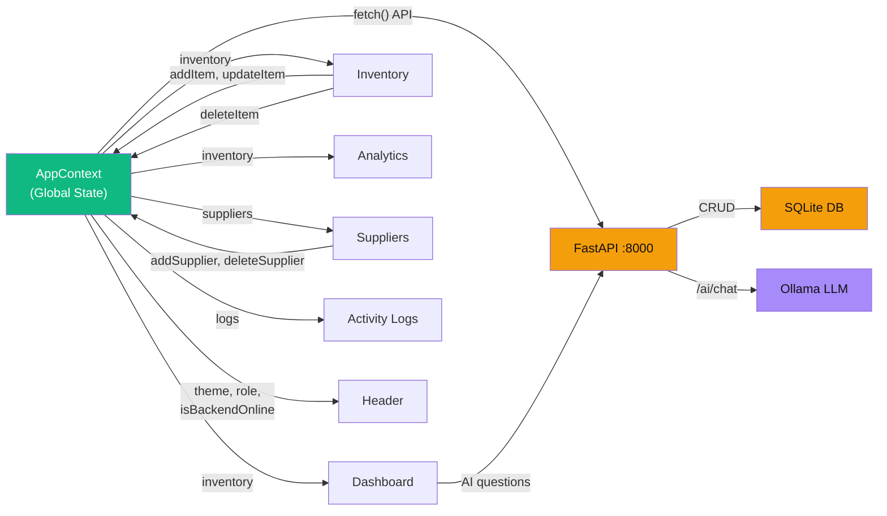

# Warehouse Management System — Project Architecture

## High-Level Flow



---

## Full-Stack Architecture



---

## File-by-File Breakdown

### 🔵 Core Bootstrap

| File | Purpose |
|------|---------|
| `index.html` | The single HTML page that the browser loads. Contains the `<div id="root">` mount point. |
| `main.jsx` | Boots React, wraps the entire app in `<AppProvider>` (global state), renders `<App />`. |
| `App.jsx` | Defines all routes via `react-router-dom`. Maps URL paths to page components inside the `DashboardLayout`. |

---

### 🟢 State Management

| File | Purpose |
|------|---------|
| `contexts/AppContext.jsx` | **The brain of the app.** Connects to the FastAPI backend via `fetch()` for all CRUD operations. Falls back to local mock data when the backend is offline (dual-mode). Exposes `addItem`, `updateItem`, `deleteItem`, `addSupplier`, `deleteSupplier`, `addLog`, theme toggling, role switching, warehouse filtering, and `isBackendOnline` status to every component via React Context. |

---

### 🔷 Layout Shell

| File | Purpose |
|------|---------|
| `layouts/DashboardLayout.jsx` | Assembles the page structure: Sidebar on the left, Header on top, page content via `<Outlet />` in the center. |
| `layouts/Sidebar.jsx` + `.css` | Renders the left navigation panel with links to Dashboard, Inventory, Analytics, Suppliers, Activity Logs, and Login. Uses `<NavLink>` for active-state highlighting. |
| `layouts/Header.jsx` + `.css` | Top bar with: global search input, **database connection status badge** (Connected/Offline), warehouse selector dropdown, theme toggle (sun/moon), **YouTube-style notification dropdown** (shows each low-stock item individually with severity and warehouse badge), and user profile display. |

---

### 📄 Pages

| File | Purpose |
|------|---------|
| `pages/Dashboard.jsx` + `.css` | Main overview. Shows KPI stat cards (total items, total value, low-stock alerts), a bar chart of stock levels, a pie chart of category distribution, **AI Inventory Analyst chatbot** (powered by Ollama `llama3.2:1b` via `/ai/chat` proxy — sends live inventory data as context for accurate answers), and a recent activity feed. |
| `pages/Inventory.jsx` + `.css` | Full inventory management table. Features: search, category filter, sorting by columns, add/edit items via modal, **styled in-app delete confirmation modal** (replaces browser `confirm()`), CSV export, pagination with auto-reset on filter/search, and row highlighting for low-stock items. |
| `pages/Analytics.jsx` + `.css` | Detailed analytics with three chart types: bar chart (stock levels), pie chart (category distribution), and line chart (stock movement trends). |
| `pages/Suppliers.jsx` | Supplier directory table. Add new suppliers via a styled in-app modal, **styled delete confirmation modal**, and view status badges (Active/Inactive). |
| `pages/ActivityLogs.jsx` | Chronological log of all actions (ADD, DELETE, RESTOCK, DISPATCH, UPDATE) with timestamps, user attribution, and quantity changes. |
| `pages/Login.jsx` + `.css` | Role switcher interface. Allows toggling between Admin and Staff roles to demonstrate role-based access differences. |

---

### 🧩 Reusable Components

| File | Purpose |
|------|---------|
| `components/ItemFormModal.jsx` + `.css` | A styled popup modal form used by the Inventory page to add new items or edit existing ones. Fields: name, category, warehouse, quantity, price, min stock threshold, supplier. **Hybrid supplier field**: dropdown when suppliers exist in DB, text input fallback when empty. |

---

### ⚙️ Backend (FastAPI + SQLite)

| File | Purpose |
|------|---------|
| `Database/main.py` | **FastAPI server** running on `localhost:8000`. CORS enabled. Endpoints: `GET/POST/PUT/DELETE /items`, `GET/POST/PUT/DELETE /suppliers`, `GET/POST /logs`, and `POST /ai/chat` (Ollama proxy). |
| `Database/models.py` | SQLAlchemy ORM models: `InventoryItem` (id, name, category, quantity, price, supplier, warehouse, minStock), `Supplier` (id, name, contact, status), `ActivityLog` (id, timestamp, action, item, qty, user). |
| `Database/schemas.py` | Pydantic schemas for request/response validation: `ItemCreate`, `Item`, `SupplierCreate`, `Supplier`, `LogCreate`, `Log`. |
| `Database/database.py` | SQLAlchemy engine and session configuration. Creates `warehouse.db` SQLite file. |
| `Database/requirements.txt` | Python dependencies: `fastapi`, `uvicorn`, `sqlalchemy`, `pydantic`. |

---

### 🤖 AI Integration (Ollama)

| Component | Details |
|-----------|---------|
| **Model** | `llama3.2:1b` (1 billion parameters, runs locally on MacBook) |
| **Server** | Ollama runs on `localhost:11434` |
| **Proxy** | FastAPI endpoint `POST /ai/chat` forwards requests to Ollama |
| **Context** | Each query sends live inventory data (items, quantities, prices, low-stock alerts, warehouse info) as a system prompt so the AI gives data-aware answers |
| **UI** | Chat-style interface on Dashboard with message bubbles, sparkle icons, model badge, loading spinner |

---

### 🎨 Styling & Design System

| File | Purpose |
|------|---------|
| `index.css` | **Global design system.** CSS custom properties for the entire color palette, typography, spacing, shadows, animations (`slideUpFade`, `pulseDanger`, `spinLoader`), and reusable utility classes (`.card`, `.btn-primary`, `.badge`, `.input-field`, `.modal-overlay`, etc.). **True black dark mode** (`#000000` base). Controls both light and dark mode via `[data-theme]`. |
| `App.css` | Additional app-level layout styles. |

---

### 📁 Configuration

| File | Purpose |
|------|---------|
| `package.json` | Project dependencies: `react`, `react-router-dom`, `lucide-react` (icons), `recharts` (charts), `date-fns` (date formatting), `concurrently` (run both servers). Scripts: `dev:frontend` (Vite), `dev:backend` (uvicorn), `dev` (both via concurrently). |
| `vite.config.js` | Vite bundler configuration with React plugin. |
| `.gitignore` | Excludes `node_modules/`, build artifacts, and `warehouse.db` from Git. |

---

## Data Flow Summary



> **Dual-mode operation:** AppContext auto-detects the backend on startup. When online, all CRUD operations persist to the SQLite database. When offline, everything works with local mock data. The AI chatbot requires both the backend and Ollama to be running.

---

## How to Run

```bash
# Terminal 1 — Backend (Database + AI Proxy)
cd my-react-app/Database
python3 -m uvicorn main:app --reload --port 8000

# Terminal 2 — Frontend (React)
cd my-react-app
npm run dev

# Ollama (must be running for AI features)
open -a Ollama

# Then open: http://localhost:5173
```

---

## Tech Stack

| Layer | Technology |
|-------|-----------|
| Frontend | React 19, Vite 8, React Router 7, Recharts 3 |
| Icons | Lucide React |
| Backend | FastAPI (Python), Uvicorn |
| Database | SQLite via SQLAlchemy ORM |
| AI | Ollama (llama3.2:1b) — local LLM |
| Styling | Vanilla CSS with Custom Properties, Inter font |
| Theme | True black dark mode (#000000) / Clean white light mode |
